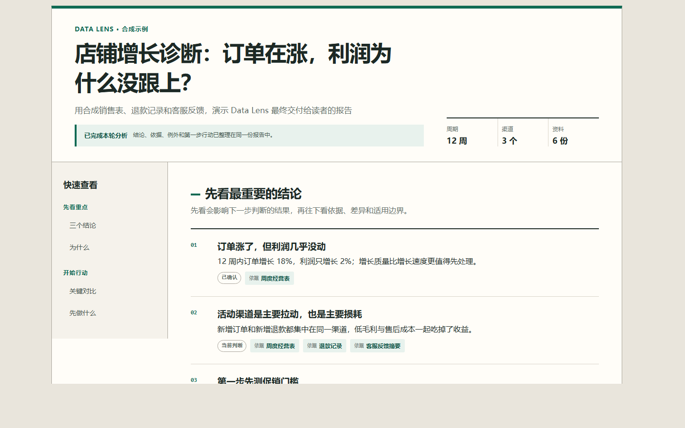
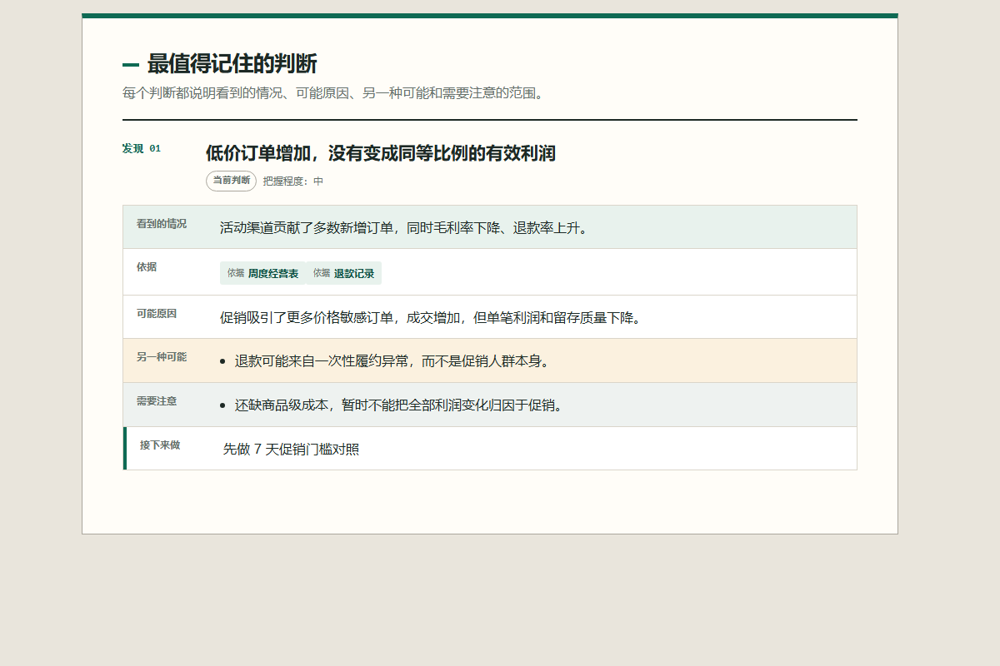
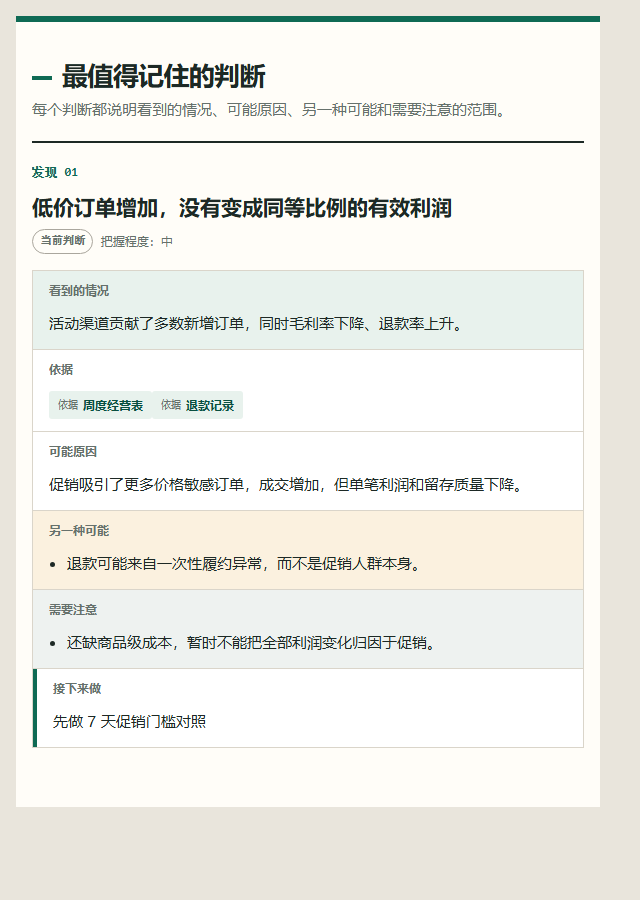

# Data Lens

中文 ｜ [English](README.en.md)

Data Lens 是一个通用深度分析 Skill。把表格、文章、访谈、PDF、图片或一整个资料目录交给它，它会帮你找出真正值得回答的问题，连接不同来源的证据，并把结果整理成一份能直接阅读和行动的报告。

它适合这样的任务：

- 资料很多，不知道先看什么；
- 表格和文字混在一起，单看一个文件容易误判；
- 已经有一个解释，但想确认有没有相反证据或别的可能；
- 不只想要总结，还想知道下一步先做什么、怎么验证。

## 30 秒上手

把仓库放进 Codex 的 Skill 目录：

```powershell
git clone https://github.com/wangge-ai/data-lens.git "$env:USERPROFILE\.codex\skills\data-lens"
```

macOS 或 Linux：

```bash
git clone https://github.com/wangge-ai/data-lens.git ~/.codex/skills/data-lens
```

重新打开一个任务，然后直接说：

```text
使用 $data-lens 深度分析 <资料目录>。
我暂时不提供分析角度，请先自己找重点，最后给我关键结论和下一步行动。
```

不用再复制一套长提示词。仓库里的 `SKILL.md` 已经包含完整工作方法；你只需要说明资料在哪里，以及最终想解决什么问题。

## 它会帮你做什么

| 你面对的情况 | Data Lens 会怎么处理 |
|---|---|
| 不知道分析什么 | 先比较几个可能的问题，优先回答最影响决策、又能被现有资料支持的那个 |
| 文件很多、关系混乱 | 先分清来源、版本、重复内容和资料角色，再判断哪些可以放在一起分析 |
| 一个解释看起来很合理 | 把事实和解释分开，主动寻找相反证据及其他可能，资料不够时明确保留疑问 |
| 结论很多，不知道先做什么 | 收敛成一个优先动作，并写清观察指标、停止条件和什么结果会改变判断 |

Data Lens 不会为了显得“深”而把报告写得更长。资料只支持描述时，它就只给描述；发现口径冲突、缺失数据或无法读取的文件时，也会直接说明。

## 可以分析哪些资料

- 销售、成本、退款、运营等 CSV、XLSX 或重复导出的表格；
- 文章、评论、访谈、案例、研究资料和聊天记录；
- PDF、图片、音频、视频及其组合；
- 多个版本、多个来源或多种资料混在一起的项目目录。

文件格式只决定怎么读取，真正采用什么分析方法，取决于你要解决的问题。

## 可以直接这样问

### 资料很多，没有预设角度

```text
使用 $data-lens 看这个文件夹。先判断里面有哪些资料、哪些实际上在回答同一个问题，
再找出最值得深入分析的方向。
```

### 要做一个业务决定

```text
使用 $data-lens 分析这些经营表、退款记录和客服反馈。
我要决定下个月先调整投放、促销还是商品结构，请告诉我判断依据和第一步动作。
```

### 已经有一个判断，想找漏洞

```text
使用 $data-lens 检查“销量下降主要是价格造成的”这个判断。
请找支持信息、相反证据和其他可能，并说明还缺什么数据才能下结论。
```

复杂任务还可以补充读者、时间范围、必须覆盖的对象和交付形式。没写的部分由 Skill 根据资料自行判断。

## 你会得到什么

一份标准报告通常包括：

1. 最值得先看的结论；
2. 支持这些结论的事实和来源；
3. 其他可能、重要例外和适用范围；
4. 当前最优先的行动；
5. 用来验证或推翻判断的观察信号。

正文默认面向普通读者。文件位置、计算明细和运行记录只在需要复核时单独提供，不会挤进主要结论。

## 安装到其他宿主

仓库根目录就是完整 Skill，可放在对应的本地目录：

```text
Codex:               ~/.codex/skills/data-lens
Claude Code:         ~/.claude/skills/data-lens
WorkBuddy/CodeBuddy: ~/.codebuddy/skills/data-lens
```

更新时在 Skill 目录执行：

```bash
git pull --ff-only
```

WorkBuddy 图形界面导入前，先生成完整 ZIP：

```bash
python scripts/package_workbuddy_skill.py
```

然后导入 `dist/` 中生成的文件。不要只复制 `SKILL.md`，否则脚本、方法说明和报告模板不会一起安装。

Data Lens 是由宿主智能体执行的本地 Skill，不是单独的网页应用。宿主能否读取某种文件、使用 OCR 或运行本地模型，取决于当前设备和宿主提供的工具。

## 效果预览

下面三张图使用完全合成的数据，只展示报告形式，不包含任何真实业务资料。

### 先给结论，再给依据



### 每个判断都说明其他可能、注意事项和下一步



### 手机上也能直接阅读



## 开发者

普通用户不需要运行命令行。开发和复核时可以使用：

```bash
python scripts/data_lens.py capabilities
python scripts/data_lens.py test
python scripts/data_lens.py validate-methods
python scripts/check_public_tree.py
python scripts/check_agent_compatibility.py
```

默认流程只依赖 Python 标准库。R、Poppler、Tesseract、PaddleOCR、ffprobe、Pillow、Whisper、DuckDB 和向量检索组件都是可选能力，不会被自动安装或静默调用。

进一步阅读：[`DESIGN.md`](DESIGN.md) ｜ [`CONTRIBUTING.md`](CONTRIBUTING.md) ｜ [`CHANGELOG.md`](CHANGELOG.md)

## License

Apache License 2.0. See [`LICENSE`](LICENSE).
