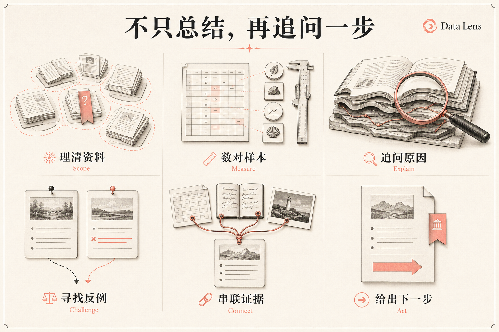
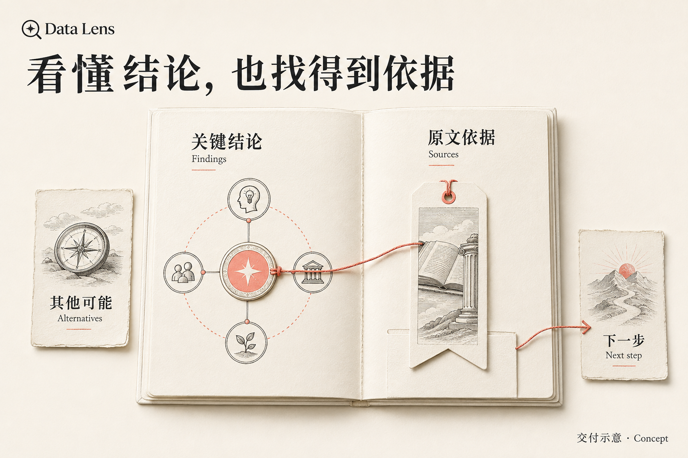

# Data Lens

中文 ｜ [English](README.en.md) ｜ [详细指南](docs/guide.zh-CN.md)


**把一堆资料，变成有依据的判断。**

Data Lens 是给 Codex、Claude Code、WorkBuddy/CodeBuddy 使用的本地分析 Skill。给它经营表、文章、一本书或混合资料，帮你理清发生了什么、为什么可能如此，以及下一步先验证什么。

模型负责理解和推理；Skill 帮它核对数字、串联来源、寻找反例，让好判断留得住、查得到。它不是另一个模型，也不是数据分析网站。

## 不只总结，再追问一步



不知道从哪儿分析，可以先找值得追的问题；已有一个判断，就去找能支持或推翻它的材料。**深度不是多写几页，而是把关键问题往下追，同时知道哪里还不能下结论。**

## 拿什么来试

| 你的资料 | 可以这样问 |
|---|---|
| 经营表、退款和客服记录 | 订单涨了，利润为什么没跟上？ |
| 一批文章或一本书 | 哪个观点反复出现？哪些原文又在反驳它？ |
| 评论、访谈和聊天记录 | 大家真正卡在哪里？不同群体是否一样？ |
| PDF、图片与多版本文件 | 哪些材料说的是同一件事？哪里互相冲突？ |

也支持音视频；具体读取能力取决于宿主和本机工具。格式决定怎么读，问题决定怎么分析。

## 最后拿到什么



一份能直接阅读的报告：**关键结论、原文依据、其他可能、适用范围、一个优先动作。** 按需交付 Markdown、离线 HTML 或数据附件；计算明细和失败记录另存，方便复核。

*以上为内置图像生成功能制作的概念配图，不是实跑截图，也不代表固定报告模板。*

## 安装与开始

需要支持本地 Skill 的宿主和 **Python 3.10+**。安装时请复制完整仓库，不要只复制 `SKILL.md`。

<details>
<summary>Codex · Windows PowerShell</summary>

```powershell
git clone https://github.com/wangge-ai/data-lens.git "$env:USERPROFILE\.codex\skills\data-lens"
```

</details>

<details>
<summary>Codex · macOS / Linux</summary>

```bash
git clone https://github.com/wangge-ai/data-lens.git ~/.codex/skills/data-lens
```

</details>

<details>
<summary>Claude Code / WorkBuddy / CodeBuddy</summary>

完整仓库放到宿主的 Skill 目录：

- Claude Code：`~/.claude/skills/data-lens`
- WorkBuddy/CodeBuddy：`~/.codebuddy/skills/data-lens`

通过 WorkBuddy 界面导入时，在仓库根目录运行：

```bash
python scripts/package_workbuddy_skill.py
```

再导入 `dist/` 下的完整 ZIP。[详细安装说明](docs/guide.zh-CN.md#安装)

</details>

安装后新开一个任务，直接说：

```text
使用 $data-lens 分析这些资料。
不要只做摘要：找出最值得关注的问题，核对关键数字和原文，
主动寻找相反证据。告诉我现在能确定什么、还缺什么，以及第一步先做什么。
```

[更多提问示例](docs/guide.zh-CN.md#怎么使用) ｜ [更新与依赖](docs/guide.zh-CN.md#依赖逻辑)

## 先说清边界

简单查数和公式计算通常用不上它。证据不足时会保留不确定性；相关和预测准确不等于因果。普通终稿或 HTML 不要求跑完全部分析流程。

核心使用 Python 标准库；OCR、音视频和部分统计能力按需依赖额外工具，不自动安装。Skill 不自行把资料上传到远程分析服务；宿主本身的数据处理规则仍由宿主决定。

## 继续了解

[完整能力与使用指南](docs/guide.zh-CN.md) · [设计说明](DESIGN.md) · [参与开发](CONTRIBUTING.md) · [更新记录](CHANGELOG.md)

<details>
<summary>开发与自测命令</summary>

```bash
python scripts/data_lens.py capabilities
python scripts/data_lens.py test
python scripts/data_lens.py validate-methods
python scripts/check_public_tree.py
python scripts/check_agent_compatibility.py
```

</details>

Apache License 2.0 · [LICENSE](LICENSE)
